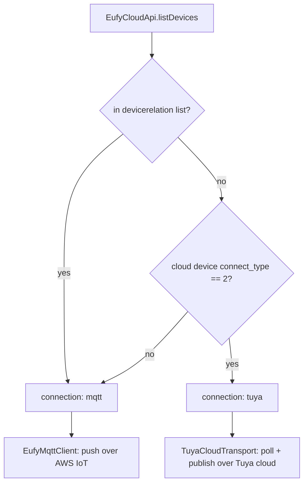
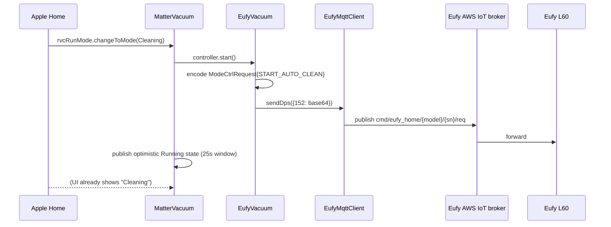
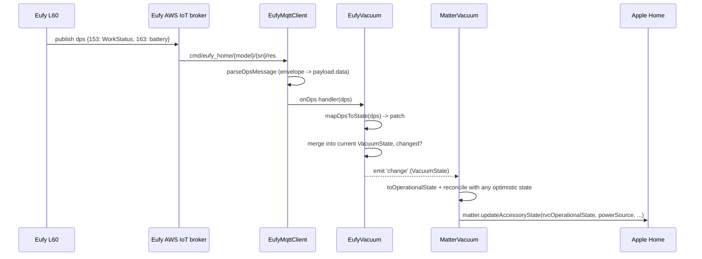

# Architecture

## Three layers

The codebase is deliberately layered so each piece is testable without a real
vacuum, a real Eufy account, or a real Homebridge process:

1. **Protocol layer** (`src/eufy/EufyCloudApi.ts`, `src/eufy/EufyMqttClient.ts`,
   `src/eufy/TuyaCloudApi.ts`, `src/eufy/TuyaCloudTransport.ts`,
   `src/eufy/codec.ts`) knows Eufy's and Tuya's wire formats and nothing
   about Homebridge or Matter. `EufyCloudApi` logs in, fetches MQTT
   credentials, and lists devices, tagging each with the `connection` it
   needs (see [Two transports](#two-transports)). Both transports implement
   `VacuumTransport`: connect/disconnect, send raw dps, receive raw dps.
   `EufyMqttClient` does it over Eufy's broker, with its own exponential-backoff
   reconnect and certificate-refresh-on-rejection logic. `TuyaCloudTransport`
   does it over `TuyaCloudApi` (Tuya's signed mobile API), polling for state.
   `codec.ts` loads the vendored `.proto` files once and exposes typed
   `encode`/`decode` for the handful of messages this plugin uses.

2. **State layer** (`src/eufy/dps.ts`, `src/eufy/EufyVacuum.ts`) holds no
   networking and no Homebridge types. `dps.ts` is a pure projection from a
   raw dps frame to a `Partial<VacuumState>`. `EufyVacuum` implements
   `VacuumController`: it owns the current `VacuumState`, applies incoming dps
   patches, emits a `change` event when the merged state actually differs,
   and turns high-level commands (`start`, `pause`, `dock`, `cleanRooms`, …)
   into `ModeCtrlRequest` protobuf messages written to dp 152.

3. **Homebridge/Matter layer** (`src/platform.ts`,
   `src/accessories/MatterVacuum.ts`) knows Homebridge and `@matter/main`
   types and nothing about protobuf or MQTT topics. `EufyCleanPlatform` is the
   `DynamicPlatformPlugin`: it validates config, logs in, discovers devices,
   wires one transport (`EufyMqttClient` or `TuyaCloudTransport`) + `EufyVacuum` + `MatterVacuum` per device,
   registers/updates Matter accessories, retries discovery with backoff on
   failure, and removes stale accessories. `MatterVacuum` maps `VacuumState`
   onto the Matter `rvcRunMode` / `rvcCleanMode` / `rvcOperationalState` /
   `powerSource` / `identify` / `serviceArea` clusters and maps their command
   handlers back onto `VacuumController` methods, including an optimistic
   state window so the Home UI updates immediately instead of waiting for the
   next state update.

`src/eufy/types.ts` is the shared contract between layers 1 and 2
(`VacuumTransport`, `VacuumController`, `VacuumState`, `EufyDeviceInfo`,
`MqttCredentials`, `Logger`). Nothing outside that file invents its own shape
for these.

## Two transports

Both carry the identical novel-API protobuf dps, so everything above the
transport (`EufyVacuum`, `MatterVacuum`, the codec) is shared. What differs is
which cloud the vacuum listens to, and getting it wrong fails silently: a
Tuya-connected vacuum accepts nothing from the MQTT broker, yet the broker
accepts the publish without error.

- Devices missing from `devicerelation` but not Tuya-connected still go to
  MQTT: eufy-clean observed Eufy omitting MQTT devices from that list for
  some accounts registered through the modern app.
- `connect_type` is per device. The product's `tuya_pid` is deliberately not
  used; it describes the model, and a model can ship on either cloud.
- `TuyaCloudApi` logs in as `eh-<eufy user id>` with a password derived from
  that id (AES, md5, then unpadded RSA against a key Tuya issues per login),
  trying EU then US. One client is shared per account, created only if a
  Tuya device exists. An expired session (`*SESSION*` error code) triggers
  one re-login and retry.
- `TuyaCloudTransport` reads state by listing the account's Tuya devices every
  `pollIntervalSeconds`, and re-reads 3s after each command so Apple Home
  catches up without waiting a full poll.
- Signing and login are pinned by known-answer tests generated from
  eufy-clean's own implementation (`__tests__/TuyaCloudApi.test.ts`).

## Data flow: a start command

## Data flow: a state update

A poll (`EufyCleanPlatform.startPolling`, default every
`pollIntervalSeconds`) re-reads the cloud device list and feeds each device's
`dps` snapshot through `EufyVacuum.applyDps` the same way, because MQTT is
push-only: a vacuum that never changes state never pushes an update, and the
poll is what keeps a long-idle vacuum's battery/status from going stale.
Tuya-connected vacuums get no pushes at all; `TuyaCloudTransport` polls on
the same interval and hands dps to `onDps`, so the rest of this flow is
unchanged from `EufyVacuum` onward.

## DPS table

Novel-API ("cloud MQTT") data points, from `src/eufy/dps.ts` (`NOVEL_DPS`):

| dp | Name | Direction | Payload |
| --- | --- | --- | --- |
| 152 | `PLAY_PAUSE` | write | base64 `ModeCtrlRequest` (all commands) |
| 153 | `WORK_STATUS` | read | base64 `WorkStatus` |
| 154 | `CLEANING_PARAMETERS` | read | base64 `CleanParamResponse` (preferred source of clean speed) |
| 158 | `CLEAN_SPEED` | read/write | fallback source of clean speed: an index into `CLEAN_SPEEDS`, or a name such as `"Standard"` (seen on a Tuya-connected L60 SES). Written as an index. |
| 160 | `FIND_ROBOT` | write | boolean |
| 163 | `BATTERY_LEVEL` | read | integer 0-100 |
| 167 | `CLEANING_STATISTICS` | read | not decoded by this plugin |
| 168 | `ACCESSORIES_STATUS` | read | not decoded by this plugin |
| 173 | `GO_HOME` | — | present in the map for parity with eufy-clean; go-home is issued via dp 152 (`START_GOHOME`), not this dp |
| 177 | `ERROR_CODE` | read | base64 `ErrorCode`, or occasionally a bare integer on some firmware |

## Protobuf messages used

Defined in the vendored `.proto` files under `proto/cloud/` and typed in
`src/eufy/codec.ts`:

- **`ModeCtrlRequest`** (`control.proto`) — every outbound command. `method`
  selects one of `START_AUTO_CLEAN`, `PAUSE_TASK`, `RESUME_TASK`,
  `STOP_TASK`, `START_GOHOME`, `START_SPOT_CLEAN`,
  `START_SELECT_ROOMS_CLEAN`, `START_SCENE_CLEAN`, with a matching
  sub-message (`autoClean`, `selectRoomsClean`, `spotClean`, `sceneClean`).
- **`WorkStatus`** (`work_status.proto`) — decoded from dp 153. Carries
  `state` (`STANDBY`/`SLEEP`/`FAULT`/`CHARGING`/`FAST_MAPPING`/`CLEANING`/
  `REMOTE_CTRL`/`GO_HOME`/`CRUISIING`), `mode.value`, and pause sub-state in
  `cleaning.state` / `goHome.state` / `charging.state`.
- **`ErrorCode`** (`error_code.proto`) — decoded from dp 177. `error` is
  treated as a real fault; `warn` (e.g. "clean the dust collector") is
  intentionally ignored so it never surfaces as a HomeKit error state.
- **`CleanParamRequest` / `CleanParamResponse`** (`clean_param.proto`) —
  decoded from dp 154. `fan.suction` inside `runningCleanParam` /
  `cleanParam` / `areaCleanParam` (checked in that order) is the primary
  source for `VacuumState.cleanSpeed`.

All other vendored protos (`common.proto`, `map_manage.proto`,
`multi_maps.proto`, `misc.proto`, `p2pdata.proto`, `scene.proto`,
`stream.proto`) are copied for completeness and future use but are not
currently decoded by this plugin.

## Reconnect and credential handling

`EufyMqttClient` owns its own reconnect loop rather than relying on `mqtt.js`
(`reconnectPeriod: 0`, i.e. disabled) so the backoff and credential-refresh
decisions are explicit and testable:

- Backoff starts at 1s and doubles up to a 60s cap on every failed
  connect/close.
- A connection that stays up for 60s ("stable") resets the backoff, so a
  broker that accepts and then quickly drops the client does not degenerate
  into a one-per-second reconnect storm.
- If the broker's error looks like a certificate/handshake/authorization
  rejection (`isCertificateRejection`), the platform calls
  `EufyCloudApi.login()` again to get a fresh MQTT credential bundle before
  retrying, since AWS IoT client certs are tied to the login session, not
  issued independently.
- `EufyCleanPlatform` keeps one `openudid` per install, persisted as a file
  under the Homebridge persist directory, because Eufy ties an MQTT session
  identity to the device id that logged in; reusing a fixed id avoids
  fighting the phone app's own session and avoids creating a new "app
  session" server-side on every Homebridge restart.
- Platform-level discovery (login + device list, distinct from the MQTT
  transport's own reconnect) has its own escalating retry ladder
  (30s, 60s, 5m, 15m) so a boot-time network race or an Eufy outage does not
  permanently disable the plugin, and does not unregister existing Matter
  accessories while it retries.

## Known unknown: room ids

`eufy-clean` (the reference implementation) only ever sends
`START_SELECT_ROOMS_CLEAN` with an empty room list; whether the L60 actually
honours a populated `rooms` list is unproven. `EufyVacuum.cleanRooms`
populates `selectRoomsClean.rooms` from `control.proto`'s declared fields on
the assumption it works, because the fields exist and eufy-clean's own gap is
"never tried it," not "tried it and it failed." No map or room-id source has
been observed on any decoded dp; `eufy-clean` never sees map data on a plain
data point either, only (unimplemented here) over a separate p2p channel.

Practically: `devices[].rooms` entries configured with `roomId` are a bet on
`selectRoomsClean.rooms` being honoured; entries configured with `sceneId`
use `START_SCENE_CLEAN`, which is the proven path. Phase 0
(`docs/PHASE0.md`, step 7) is the place this gets resolved against a real
account — its checklist has a line for "did dp 7 decode any map/room data",
and its absence is itself a useful, expected result that pushes room support
toward scenes rather than a live room list.
