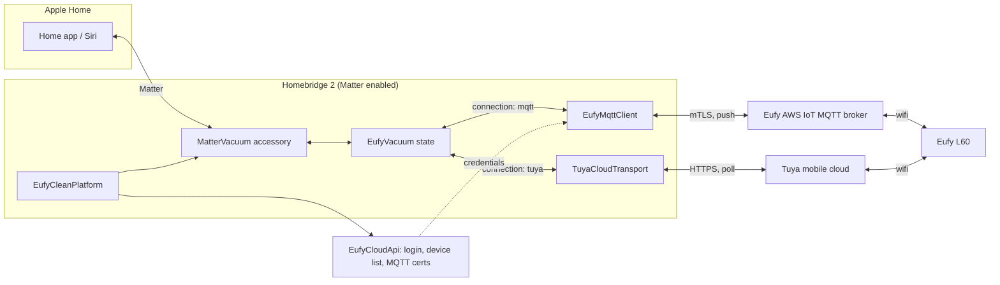

# homebridge-eufy-clean

A Homebridge 2 platform plugin that exposes Eufy Clean robot vacuums to Apple
Home as native Matter Robotic Vacuum Cleaners.

## Why cloud, not local Tuya

This plugin targets the Eufy L60 family: **L60** (T2267), **L60 Hybrid**
(T2268), **L60 SES** (T2277) and **L60 Hybrid SES** (T2278). Every existing
local-Tuya Homebridge plugin (including the maintained hov3rcraft fork) lists
these as unsupported, calling their protocol "encrypted". It is not encrypted;
it is protobuf, base64-encoded, carried inside Tuya data points (the "novel
API"). There is no known way to drive it with just a local key and an IP
address.

The working approach is the one [eufy-clean](https://github.com/martijnpoppen/eufy-clean)
uses: log in to Eufy's cloud with an email and password, then reach the
vacuum through whichever cloud it was onboarded to. Two exist, and the same
model can be on either:

- **Eufy MQTT**: a per-account client certificate for Eufy's AWS IoT broker.
  State is pushed.
- **Tuya cloud**: vacuums Eufy onboarded through Tuya (`connect_type: 2` in
  Eufy's device list, for example some L60 SES units). The plugin logs in to
  Tuya's mobile API with your Eufy account, no separate Tuya account needed.
  Commands are immediate; state is polled every `pollIntervalSeconds`.

The plugin picks the right one per device automatically. Both need an Eufy
account and internet access; there is no LAN-only mode for these models.

## Requirements

- Homebridge **2.0.0** or later, with **Matter enabled** — either on the main
  bridge or on a child bridge. This plugin publishes Matter accessories only;
  it does not fall back to HomeKit Accessory Protocol (HAP).
- Node.js **22** or later.
- An Eufy account (email + password) with the vacuum already set up in the
  Eufy app.

## Install on a fresh Linux server

1. Install Node 22 and Homebridge with `hb-service` (see the
   [official Homebridge install docs](https://github.com/homebridge/homebridge/wiki)
   for your distribution), including `homebridge-config-ui-x`:

   ```
   curl -sSfL https://repo.homebridge.io/KEY.gpg | sudo gpg --dearmor -o /usr/share/keyrings/homebridge.gpg
   echo "deb [signed-by=/usr/share/keyrings/homebridge.gpg] https://repo.homebridge.io stable main" | sudo tee /etc/apt/sources.list.d/homebridge.list
   sudo apt update
   sudo apt install -y homebridge
   ```

2. Open the Homebridge UI (default `http://<server>:8581`), finish the setup
   wizard, and confirm the bridge shows Homebridge 2.x.

3. Enable Matter: Homebridge UI → Settings → Bridge Settings → enable Matter
   support, then restart Homebridge. This plugin refuses to publish anything
   if Matter is not enabled; it logs a warning and keeps retrying instead of
   crashing.

## Install the plugin

From the Homebridge UI: Plugins → search `homebridge-eufy-clean` → Install.

From the CLI:

```
sudo npm install -g homebridge-eufy-clean
```

## Recommended: run on a child bridge

Put this plugin on its own child bridge (Homebridge UI → Plugins → this
plugin → "Bridge Settings" → Child Bridge) with Matter enabled on that child
bridge. A dedicated bridge isolates a slow Eufy login or an MQTT reconnect
storm from every other accessory, and lets you re-pair just the vacuums in
Apple Home without touching the rest of your setup.

## Config example

```json
{
  "platform": "EufyClean",
  "name": "Eufy Clean",
  "email": "you@example.com",
  "password": "your-eufy-password",
  "pollIntervalSeconds": 60,
  "devices": [
    {
      "deviceId": "T2277XXXXXXXXXXXX",
      "name": "Living Room Vacuum",
      "rooms": [
        { "name": "Kitchen", "roomId": 3 },
        { "name": "Living Room", "sceneId": 1 }
      ]
    }
  ]
}
```

| Field | Required | Description |
| --- | --- | --- |
| `platform` | yes | Must be `"EufyClean"`. |
| `name` | no | Display name for the platform in Homebridge logs. |
| `email` | yes | Eufy account email. |
| `password` | yes | Eufy account password. |
| `pollIntervalSeconds` | no (default `60`, minimum `10`) | How often the plugin re-reads vacuum state. For MQTT vacuums this keeps an idle vacuum's battery and status fresh; for Tuya-connected vacuums it is how state updates arrive at all, so it bounds how stale Apple Home can be (commands still apply immediately). |
| `devices` | no | Explicit list of vacuums to publish. If omitted, every vacuum on the account is published. |
| `devices[].deviceId` | yes (if `devices` is set) | The device's `device_sn`, e.g. `T2277XXXXXXXXXXXX`. See Phase 0 discovery below to find it. |
| `devices[].name` | yes (if `devices` is set) | Name shown in Apple Home. |
| `devices[].rooms` | no | Room targets for the Matter Service Area cluster. Each entry needs a `name` plus either `roomId` (a map room id) or `sceneId` (an Eufy app scene index) — never both. Omit entirely to expose only whole-home cleaning. |

## Pairing in Apple Home

1. Restart Homebridge after installing and configuring the plugin.
2. In the Home app, add an accessory as usual (Add Accessory → scan the
   Homebridge/child-bridge QR code or enter its setup code from the
   Homebridge UI).
3. Each configured vacuum appears as a separate Matter accessory during
   pairing; add it like any other Matter device.

### What appears in Home

- A **Robot Vacuum** tile with start/stop and status (cleaning, idle,
  charging, docked, returning to dock, error).
- **Clean modes** Quiet, Standard, Turbo, Max, mapped from the vacuum's fan
  speed.
- **Battery level** and charging state.
- **Identify** ("locate my vacuum" via the vacuum's find-me chime).
- A **Rooms / Areas** picker, if `devices[].rooms` is configured. Selecting
  rooms and starting a clean sends either a room-targeted command or a scene
  command depending on which id type was configured (see ARCHITECTURE.md for
  the room-id caveat).

## Phase 0 discovery

Before configuring `devices[].deviceId` and rooms, run the discovery script
against your own account to find the real model code, device id, and which
`WorkStatus` values your L60 emits. See [docs/PHASE0.md](docs/PHASE0.md).

## Troubleshooting

- **"publishes vacuums over Matter only" warning, nothing appears**: Matter is
  not enabled on the bridge (or child bridge) this plugin runs on. Enable it
  in Homebridge UI → Bridge Settings and restart.
- **Login failures**: check email/password are correct for the same Eufy
  account used in the Eufy app. The plugin tries both the modern "Eufy" app
  login and the legacy "Eufy Clean" app login before giving up; if both fail
  the log lists both failure reasons. Login and MQTT retries back off
  automatically, so a transient Eufy outage recovers without a restart.
- **Vacuum appears but never updates or responds**: check which connection
  it was routed to. With debug logging on, each cloud device logs its
  `connect_type`; `2` means Tuya cloud. A Tuya-connected vacuum silently
  ignores MQTT, so if routing looks wrong, run `bun run discover` (see
  [docs/PHASE0.md](docs/PHASE0.md)): its device table shows the `connection`
  chosen and it can send a test command over that connection.
- **Vacuum accessory is stuck / stale after removing it from config**: it is
  cleaned up automatically the next time the platform successfully discovers
  devices; it is not removed on a failed discovery attempt, so credentials or
  connectivity must be working first.

## Architecture



See [ARCHITECTURE.md](ARCHITECTURE.md) for the full data flow, DPS table and
protocol details.

## Attribution

- Protocol understanding, the vendored `.proto` files and the login/MQTT/Tuya
  approach are derived from [eufy-clean](https://github.com/martijnpoppen/eufy-clean)
  by Martijn Poppen. See [NOTICE](NOTICE) for the full attribution and what
  was and was not copied verbatim.
- The Homebridge 2 Matter accessory structure follows
  [homebridge-roborock-matter-vacuum](https://github.com/jakemgold/homebridge-roborock-matter-vacuum)
  by Jake Goldman as a structural reference; no code from it is reused.

## Licence

MIT. See [package.json](package.json) for the licence field and [NOTICE](NOTICE)
for third-party attribution requirements.
